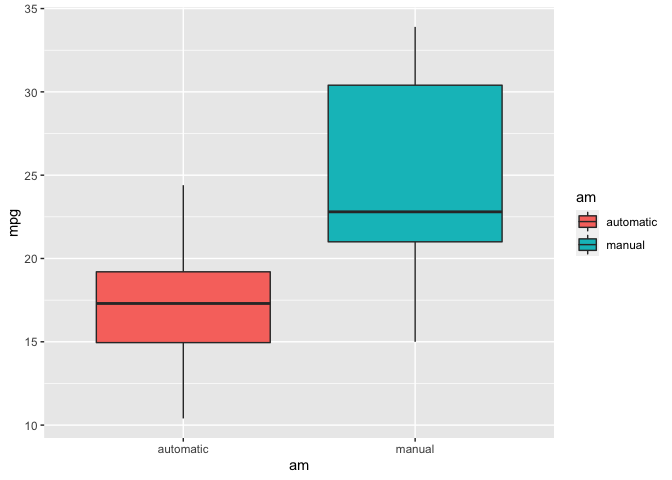
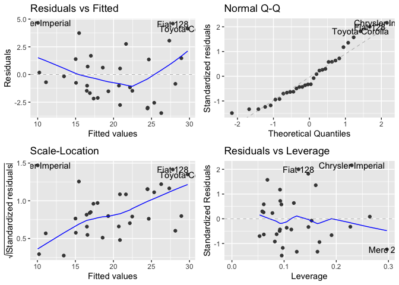

Introduction
------------

This project used regression to analyze the relationships between a set
of variables and miles per gallon (MPG), there are two main questions to
answer in this project:

-   Is an automatic or manual transmission better for MPG?
-   Quantify the MPG difference between automatic and manual
    transmissions

Executive Summary
-----------------

The procedure of this project is: - data importing and pre-processing -
exploratory data analysis - building multiple models - model evaluation
and selection - conclusion of answers to the question

Data preprocessing
------------------

    data(mtcars)
    mtcars$am <- as.factor(mtcars$am)
    levels(mtcars$am) <- c("automatic", "manual")

    mtcars$cyl <- as.factor(mtcars$cyl)
    mtcars$gear <- as.factor(mtcars$gear)
    mtcars$vs <- as.factor(mtcars$vs)
    levels(mtcars$vs) <- c("V", "S")

Exploratory data analysis
-------------------------

    dim(mtcars)

    ## [1] 32 11

The dataset has only 32 observations. Let’s have a look of the
relationship between mpg and am:

    ggplot(mtcars, aes(am, mpg)) +
          geom_boxplot(aes(fill = am))

Looks like the manuals have a higher mpg.

Building multiple models
------------------------

We can see that there are other correlations of mpg, indicating that the
variance can be explained by the model will be relatively low if we only
include am as predictor.

### Building baseline model

    base_model <- lm(mpg ~ am, mtcars)
    summary(base_model)

    ## 
    ## Call:
    ## lm(formula = mpg ~ am, data = mtcars)
    ## 
    ## Residuals:
    ##     Min      1Q  Median      3Q     Max 
    ## -9.3923 -3.0923 -0.2974  3.2439  9.5077 
    ## 
    ## Coefficients:
    ##             Estimate Std. Error t value Pr(>|t|)    
    ## (Intercept)   17.147      1.125  15.247 1.13e-15 ***
    ## ammanual       7.245      1.764   4.106 0.000285 ***
    ## ---
    ## Signif. codes:  0 '***' 0.001 '**' 0.01 '*' 0.05 '.' 0.1 ' ' 1
    ## 
    ## Residual standard error: 4.902 on 30 degrees of freedom
    ## Multiple R-squared:  0.3598, Adjusted R-squared:  0.3385 
    ## F-statistic: 16.86 on 1 and 30 DF,  p-value: 0.000285

According to the adjusted R-squared, we know the performance of the
baseline model can be improved. Let’s include all the predictors:

### Building full model

    full_model <- lm(mpg ~ ., mtcars)
    summary(full_model)

    ## 
    ## Call:
    ## lm(formula = mpg ~ ., data = mtcars)
    ## 
    ## Residuals:
    ##     Min      1Q  Median      3Q     Max 
    ## -3.2015 -1.2319  0.1033  1.1953  4.3085 
    ## 
    ## Coefficients:
    ##             Estimate Std. Error t value Pr(>|t|)  
    ## (Intercept) 15.09262   17.13627   0.881   0.3895  
    ## cyl6        -1.19940    2.38736  -0.502   0.6212  
    ## cyl8         3.05492    4.82987   0.633   0.5346  
    ## disp         0.01257    0.01774   0.708   0.4873  
    ## hp          -0.05712    0.03175  -1.799   0.0879 .
    ## drat         0.73577    1.98461   0.371   0.7149  
    ## wt          -3.54512    1.90895  -1.857   0.0789 .
    ## qsec         0.76801    0.75222   1.021   0.3201  
    ## vsS          2.48849    2.54015   0.980   0.3396  
    ## ammanual     3.34736    2.28948   1.462   0.1601  
    ## gear4       -0.99922    2.94658  -0.339   0.7382  
    ## gear5        1.06455    3.02730   0.352   0.7290  
    ## carb         0.78703    1.03599   0.760   0.4568  
    ## ---
    ## Signif. codes:  0 '***' 0.001 '**' 0.01 '*' 0.05 '.' 0.1 ' ' 1
    ## 
    ## Residual standard error: 2.616 on 19 degrees of freedom
    ## Multiple R-squared:  0.8845, Adjusted R-squared:  0.8116 
    ## F-statistic: 12.13 on 12 and 19 DF,  p-value: 1.764e-06

As we predicted, the performance of the model improved. However, the
data has only 32 observations, to include all the 10 predictors seems to
be too bulky, let’s try if selecting subsets of predictors can do any
better. Let’s try stepwise selection method:

### Building smaller model

    step_model <- step(full_model, direction = "both", trace = FALSE)
    summary(step_model)

    ## 
    ## Call:
    ## lm(formula = mpg ~ wt + qsec + am, data = mtcars)
    ## 
    ## Residuals:
    ##     Min      1Q  Median      3Q     Max 
    ## -3.4811 -1.5555 -0.7257  1.4110  4.6610 
    ## 
    ## Coefficients:
    ##             Estimate Std. Error t value Pr(>|t|)    
    ## (Intercept)   9.6178     6.9596   1.382 0.177915    
    ## wt           -3.9165     0.7112  -5.507 6.95e-06 ***
    ## qsec          1.2259     0.2887   4.247 0.000216 ***
    ## ammanual      2.9358     1.4109   2.081 0.046716 *  
    ## ---
    ## Signif. codes:  0 '***' 0.001 '**' 0.01 '*' 0.05 '.' 0.1 ' ' 1
    ## 
    ## Residual standard error: 2.459 on 28 degrees of freedom
    ## Multiple R-squared:  0.8497, Adjusted R-squared:  0.8336 
    ## F-statistic: 52.75 on 3 and 28 DF,  p-value: 1.21e-11

According to the result, it not only decreased p-value, but also
increased the degrees of freedom and the adjusted R-squared of the
model. We can use anova to check if the smaller model is really better
than the full model:

    anova(step_model, full_model)

    ## Analysis of Variance Table
    ## 
    ## Model 1: mpg ~ wt + qsec + am
    ## Model 2: mpg ~ cyl + disp + hp + drat + wt + qsec + vs + am + gear + carb
    ##   Res.Df    RSS Df Sum of Sq      F Pr(>F)
    ## 1     28 169.29                           
    ## 2     19 130.05  9    39.235 0.6369 0.7524

As the anova result shows, the step model is not significantly greater
than the full model, and vice versa. Using the reasons mentioned above,
we pick the smaller model as the best model.

Model evaluation
----------------

To see if our model is good, we need to go through some assumption
checks:

    autoplot(step_model)

The residuals looks okay as we have only 32 data points. Let’s check the
multicollinearity.

    vif(step_model)

    ##       wt     qsec       am 
    ## 2.482952 1.364339 2.541437

VIF shows that the multicollinearity is not a problem in our case.

Conclusion
----------

Back to the core questions: Is an automatic or manual transmission
better for MPG? Quantify the MPG difference between automatic and manual
transmissions.

To answer these questions, we need to go back to the simple linear
regression with only am as preditor, since the multiple regression model
did not generate a significant p-value for the am variable, and the
stepwise picked model did not include am as predictor. According to the
result of the simple linear regression model, the average MPG of manual
transmission is significantly (p-value = 0.0003) more than the automatic
tranmissions, the quantity is 7.245. In addition, noticing the simple
linear regression model is limited at the predictive performance.
